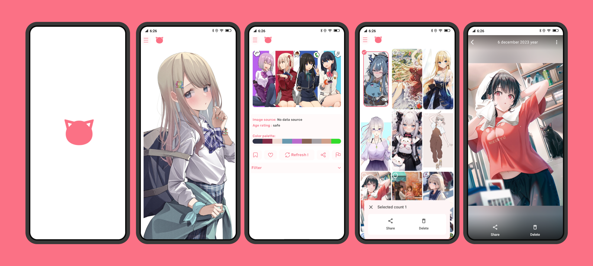

# WaifuPics

WaifuPics is a simple and fun mobile application that allows you to enjoy various content about Nekos. You can use it to view random images, facts, quotes, wallpapers, emojis, and more about Nekos. NekosApp is powered by [NekosAPI], a free and open source API that provides various endpoints for Nekos.

Here is a possible readme file for a mobile application that is based on https://nekosapi.com/:
### Features
* Random Neko images: You can browse and download high-quality Neko images from different categories, such as cute, anime, furry, etc.
* Random Neko facts: You can learn interesting and surprising facts about Nekos, such as their origin, behavior, culture, etc.
* Random Neko quotes: You can read inspirational and motivational quotes from famous Nekos or Neko lovers, such as Hello Kitty, Catwoman, Garfield, etc.
* Random Neko wallpapers: You can set beautiful and adorable Neko wallpapers for your home screen or lock screen.
* Random Neko emojis: You can express your emotions with cute and funny Neko emojis, such as 😻, 🐱, 😼, etc.
And more…: Coming soon
### Technologies
NekosApp is developed using the following technologies:

* Kotlin: Kotlin is a modern and concise programming language that runs on the JVM and can be used to develop Android applications.
* Jetpack Compose: Jetpack Compose is a declarative UI toolkit that allows you to build beautiful and native Android UIs using Kotlin.
* Retrofit: Retrofit is a type-safe HTTP client for Android that makes it easy to consume RESTful web services.
* Coil: Coil is an image loading and caching library for Android that supports fetching, decoding, and displaying images from various sources.
* Coroutines: Coroutines are a way of managing asynchronous tasks in Kotlin that simplify concurrency and avoid callback hell.

### Screenshots
Here are some screenshots of NekosApp:

### Installation
To install NekosApp, you can download the APK file from [this link] and install it on your Android device. Alternatively, you can clone this repository and build the app using Android Studio.

### License
NekosApp is licensed under the MIT License. See [LICENSE] for more details.
